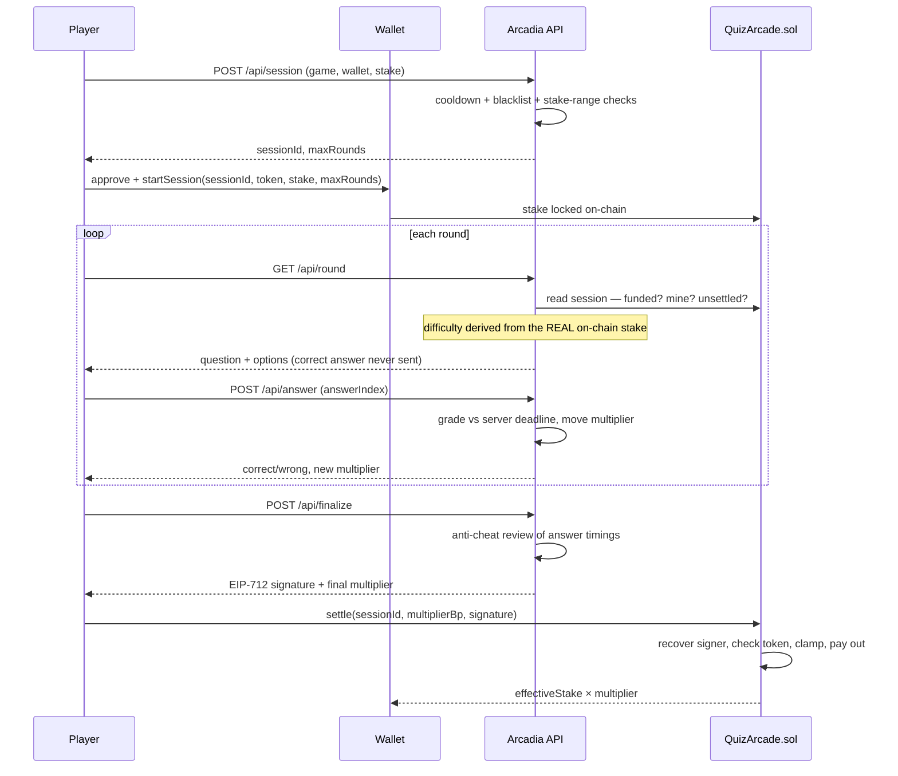

<div align="center">

# 🕹️ ARCADIA

**A skill-based quiz arcade on Celo. Stake stablecoins, answer under pressure, settle on-chain.**

[](https://celoscan.io/address/0xFb2F048B9A088D6ef0Cf3413B90F4Cef76D0eb49)
[](https://nextjs.org)
[](https://soliditylang.org)
[](https://book.getfoundry.sh)
[](./LICENSE)

`play@arcadia.uno` · [@arcadia_uno](https://twitter.com/arcadia_uno)

</div>

---

## What it is

You stake a stablecoin, play a short run of timed multiple-choice rounds, and your **multiplier**
moves with every answer. Get it right, it climbs. Get it wrong, it falls. At the end the backend
signs your result and the contract pays out `effectiveStake × multiplier`.

The house never sees your answers before you do, and the server never trusts your client. Correct
answers stay server-side, deadlines are stamped server-side, and your stake is read **from the
chain** — not from whatever your browser claims it is.

> **Stakes are real money on Celo mainnet.** Difficulty scales with your bet and the question banks
> are deliberately hard. This is a skill game, not a faucet.

<table>
<tr><td><b>Chain</b></td><td>Celo mainnet (42220) · Celo Sepolia testnet (11142220)</td></tr>
<tr><td><b>Tokens</b></td><td>USDm (cUSD) · USDC · USDT — one contract, all three</td></tr>
<tr><td><b>Games live</b></td><td>9 formats, 4,829 hand-tiered questions + procedurally generated maths</td></tr>
<tr><td><b>Settlement</b></td><td>EIP-712 signed by a trusted signer, verified on-chain</td></tr>
<tr><td><b>Stake range</b></td><td>$0.10 – $1.00 per session (app-enforced)</td></tr>
</table>

---

## Repositories

Arcadia is three repos that deploy independently.

| Repo | What it is | Runs on |
|---|---|---|
| **[Arcadia-backend](https://github.com/greyw0rks/Arcadia-backend)** ← you are here | Stateful API, game engine, question banks, trusted signer | Railway |
| **[Arcadia-frontend](https://github.com/greyw0rks/Arcadia-frontend)** | Public UI; proxies `/api/*` to the backend | Vercel |
| **[arcadia-contracts](https://github.com/greyw0rks/arcadia-contracts)** | `QuizArcade.sol` + Foundry tests and deploy scripts | Celo |

Backend and frontend are the **same Next.js codebase**, distinguished by one env var: set
`BACKEND_URL` and `/api/*` proxies to the backend; leave it unset and the app serves its own API.
The backend **must be always-on** — the session store lives in process memory, so a sleeping host
drops every in-flight game.

---

## How a game works



If a session is never settled it expires after the TTL (1 hour by default) and anyone can call
`cancelExpired` to return the stake.

### The API surface

| Route | Does |
|---|---|
| `POST /api/session` | Creates a session. Enforces stake range, per-game cooldown, blacklist. |
| `GET /api/round` | Serves the next question. Returns **402** until the stake is confirmed on-chain. |
| `POST /api/answer` | Grades one answer against a server-stamped deadline, moves the multiplier. |
| `POST /api/finalize` | Runs anti-cheat, signs the EIP-712 settlement. Idempotent. |
| `GET /api/games` | Game registry — titles, bank sizes, `available` flags. |
| `GET /api/leaderboard` · `/api/profile` | Rankings and player history, indexed from chain logs. |
| `GET /api/analytics` | Aggregate play statistics. |
| `/api/admin/*` | Blacklist, alerts, operator tooling. Secret-gated. |
| `/api/v2/*` | Private-beta routes. Dark by default on production — see [V2](#v2--private-beta). |

### Why you can't cheat it

Every one of these is enforced on the server or on-chain, never in the client:

- **The correct answer never leaves the server.** `/api/round` returns options only.
- **Deadlines are server-stamped.** `servedAt` is set when the round is built; a late answer is
  wrong no matter what it says. A small grace window absorbs network latency.
- **Stake is read from the chain, not the request.** `/api/round` calls the contract to confirm the
  session is funded, owned by the caller, unsettled, and on the right token. Difficulty is derived
  from that on-chain value — so you can't ask for an easy session and stake the maximum.
- **Response timings are recorded and reviewed.** Runs that answer faster than a human can read are
  classified at finalize time; flagged runs don't get signed, and the stake becomes refundable via
  `cancelExpired` rather than being seized.
- **Signatures are bound to one session, one multiplier, one token.** The v2 EIP-712 `Settlement`
  typehash includes `token`, which kills cross-token replay. The domain version is `"2"`, so v1
  signatures can never validate here.
- **No repeats within a session.** The picker buckets the bank by tier and draws without
  replacement, seeded per session — two players in the same round see different questions.

---

## The games

Nine formats are live. All are single-answer multiple choice; the difficulty comes from the question
banks and the clock, not the input method.

| Format | ID | Base timer | Bank |
|---|---|---|---|
| Trivia Rush | `trivia` | 8s | 1,546 |
| True / False Blitz | `truefalse` | 5s | 1,069 |
| Riddle Me This | `riddles` | 9s | 612 |
| Emoji Puzzle | `emoji` | 8s | 337 |
| Capital Quiz | `capitals` | 7s | 313 |
| Odd One Out | `oddoneout` | 8s | 330 |
| GeoGuess | `geo` | 10s | 312 |
| Name That Landmark | `landmark` | 10s | 310 |
| Math Sprint | `math` | 6s | procedural — never repeats |

Shipping soon, already registered but flagged `available: false`: Letter League (`word`),
Logo Quiz (`logo`), Movie Stills (`movie`), Hex Match (`color`).

### Difficulty is bet-scaled

Questions carry a `tier` — `easy`, `medium`, `hard`, `extreme`. Your stake picks a **recipe** that
decides the tier mix, and it also shrinks the clock.

```
$0.10  →  3 rounds  ·  mostly hard, some extreme
$0.30  →  4 rounds  ·  more extreme
$0.50  →  5 rounds  ·  mostly extreme
$1.00  →  6 rounds  ·  all extreme, timer at its floor
```

Two deliberate choices worth knowing:

- **There is a difficulty floor.** The bet fraction is remapped onto `[0.5, 1]`, so even a
  minimum-stake session is hard. Without it, a competent player could grind trivial questions at
  $0.10 for a reliable positive expectation and slowly drain the treasury.
- **Easy and medium questions are never served.** The lowest recipe already starts at `hard`. The
  banks carry ~1,100 easy/medium entries that the live game doesn't touch — they exist for V2, which
  needs headroom *below* current difficulty.

Timers shrink by up to 75% at maximum difficulty, with a hard 3-second floor.

### The multiplier

Starts at **1.0x**. Every correct round is **+0.1x**, every wrong round **−0.1x**, floored at zero
and capped by the `maxRounds` your session committed to on-chain. The contract clamps it again on
settle, so a compromised signer still can't mint an arbitrary payout.

---

## Contracts

`QuizArcade.sol` on Celo mainnet — one multi-token contract, house-treasury model.

| | |
|---|---|
| **Address** | [`0xFb2F048B9A088D6ef0Cf3413B90F4Cef76D0eb49`](https://celoscan.io/address/0xFb2F048B9A088D6ef0Cf3413B90F4Cef76D0eb49) |
| **Trusted signer** | `0x350FA35efe85Bfce23Bdc090fF9dF0686fdab26b` |
| **Rake** | 300 bps (3%) default |
| **Session TTL** | 3600s |

**Core flow:** `startSession` locks the stake and reserves the maximum possible payout ·
`settle` verifies the EIP-712 signature and pays out · `cancelExpired` / `batchCancelExpired`
refund stale sessions.

**Owner controls:** `enableToken`, `setMaxStake` (per-token), `setSigner`, `setRakeBps`,
`setMaxRoundsCap`, `setSessionTtl`, `fundPool`, `withdrawFree`, `emergencyWithdraw`.

Notable hardening in v2, each fixing something real:

- **Per-token stake caps.** Mixing 6-decimal USDC with 18-decimal USDm under one global cap meant
  one of them was wrong by twelve orders of magnitude.
- **Payout reserved from the session's own `maxRounds`**, not the global cap — the contract can't
  promise more than it holds, without over-reserving on short sessions.
- **`emergencyWithdraw` preserves `lockedForSessions`.** In v1 an emergency drain stranded players
  who hadn't settled; now they can still cancel and recover.
- **CELO is blocked from `enableToken`.** Celo's token duality means the CELO ERC-20 and the native
  asset share an address, so `balanceOf` would include native balance and inflate the solvency check.

`src/QuizArcadeV2.sol` is an **earlier draft**, despite the name — it has a single global
`maxStake`. The deployed production contract is `QuizArcade.sol`. Don't build on the other one.

`src/TestUSD.sol` is a testnet faucet token with an open `mint()`. Testnet only, obviously.

---

## Stack

**App** — Next.js 16.2 (App Router) · React 19.2 · TypeScript 5.6 · wagmi 2.19 + viem 2.52 ·
RainbowKit 2.2 · TanStack Query 5 · Vitest · Neon Postgres

**Contracts** — Solidity ^0.8.24 · Foundry · OpenZeppelin 5.6

Postgres is optional in development — without `DATABASE_URL` the app keeps cooldowns, blacklist and
history in memory, which is what CI runs against.

```
app/api/           route handlers
server/
  sessions.ts      session state machine (in-memory)
  signer.ts        EIP-712 settlement signing
  chain.ts         read-only on-chain calls (viem)
  difficulty.ts    bet → difficulty, round count, timer scaling
  engine.ts        pure multiplier math, mirrors the contract
  anticheat.ts     timing analysis + classification
  games/           one module per format + the shared tiered picker
  db.ts            Postgres, migrations run at startup
data/              question banks (JSON, tier-tagged)
docs/              specs and runbooks
lib/contract.ts    chain/token/contract constants — shared with the frontend
```

---

## Run it locally

```bash
npm install
cp .env.example .env.local     # NEXT_PUBLIC_* + SETTLEMENT_SIGNER_PRIVATE_KEY
npm run dev                    # http://localhost:3000
```

Point `NEXT_PUBLIC_CELO_NETWORK=testnet` at Celo Sepolia so you're not playing with real money.
Demo sessions skip the on-chain funding gate entirely, which is the fastest way to exercise the
game loop.

```bash
npm test                       # vitest
cd ../arcadia-contracts/celo && forge test
```

CI runs typecheck, tests and build on every push and PR.

---

## V2 — private beta

V2 replaces win-now/lose-now with a **weekly pooled economy**: buy in once a week, ride a multiplier
that moves per question, bust at zero, rebuy or wait for Monday. Payouts come from a shared pool at
week's end instead of from the house on every session.

**This is not public and is not on mainnet.** It runs as a gated private beta on its own
infrastructure — separate Railway project, separate Neon database, Celo Sepolia with a faucet token,
and an access-code gate that binds a code to one wallet via a signature. Production stays dark: the
V2 routes 404 there. It'll live at its own beta subdomain when testers are on it.

The economy design — buy-in windows, per-question multiplier deltas, progressive difficulty, rake
and pool mechanics — is specced in **[`docs/ARCADIA_V2_ECONOMY_SPEC.md`](./docs/ARCADIA_V2_ECONOMY_SPEC.md)**.
Environment and access-gate runbooks (`docs/STAGING_SETUP.md`, `docs/V2_STAGING_HANDOFF.md`) live on
the `v2` branch alongside the code they describe.

The pool contract and the weekly settlement engine **are not written yet**. What exists today is the
fence around where they go.

---

## Known issues

- **The on-chain stake cap is $5; the app enforces $1.** The app is the stricter of the two, but a
  transaction sent directly to the contract could stake up to $5. Difficulty clamps correctly at
  that point and solvency accounting holds, so this is a consistency gap rather than a drain vector
  — but `setMaxStake` should be brought down to match.
- **`render.yaml` is stale.** It still references Stacks and Render. Railway is what actually runs;
  the file is unused and due for deletion.
- **`QuizArcadeV2.sol` is misleadingly named** — see [Contracts](#contracts).
- **Access gating for V2 assumes a single replica.** The allowlist is in-process, so a second
  Railway replica wouldn't observe a revocation until redeploy.

---

<div align="center">

**Proprietary.** Copyright © 2024–2026 greyw0rks. All rights reserved.
See [LICENSE](./LICENSE) — this source is published for transparency, not for reuse.

</div>
